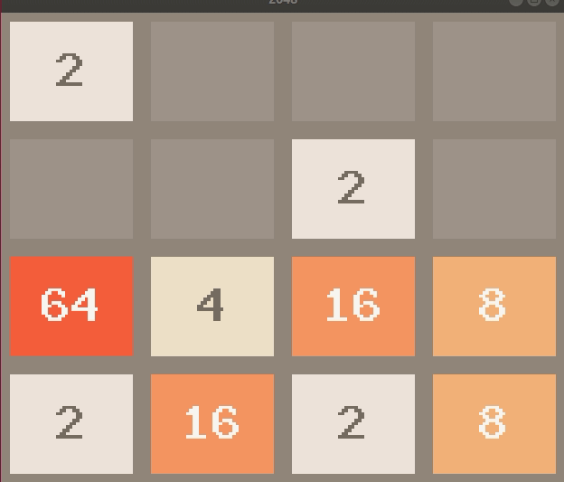

# 2048-PyTorch-DQN

Implementing [Deep Q-Network](https://deepmind.com/research/dqn/) with `PyTorch` to solve 2048. 
It supports both [DQN](https://arxiv.org/abs/1312.5602) and [Double DQN](https://arxiv.org/abs/1509.06461).

#### Requirements
`NVIDIA GPU` and `CUDA`, of course...  and `PyTorch`, along with some others in `requirements.txt`

#### 2048

[2048](https://github.com/gabrielecirulli/2048) is a popular game by Gabriele Cirulli, 
and I am using a version of [gym](https://github.com/mllobet/gym-2048).

### How to use this...
One could rely on pure `explorations`, but `optimal moves` are
probabilistically speaking not observed often enough. Therefore, use generated data,
which teach the network to learn from better moves. Those generated data come from
the discussion [here](https://stackoverflow.com/questions/22342854/what-is-the-optimal-algorithm-for-the-game-2048)

To generate data, run the following:

    $ python3 generate_replay_memory.py

To start the training, run the following:
    
    $ python3 train_dqn.py

#### Result

##### Without the training data:
After some training (of more than 6 hours with NVIDIA 1060), 
I have seen its performance getting better than complete random moves, on average.
However, the idea of `Q-learning` assumes that its search spaces will be visited,
like in the case of `Monte Carlo Search`, for a number of times to revise its Q-Values.

The current model has a weakness. The original scoring system in the game 
makes the agent unable to learn the essence of optimal move. Double DQN of course does not
help in this case. With the original scoring system of 2048,
it does not (probabilistically speaking) see the value in `corners`; this will only make
sense to those who knows how to play 2048 well.
 
A solution to make the training go faster is to change the score system for the agent.
But this is not applicable to other games.
Another solution is to have a ridiculous amount of training hours... And hope it sees the
value in the corners.

##### With the training data:
Looks like much more promising than earlier, but still not too satisfactory. I am not sure if
the model has enough parameters or too many. `git stash`ing for the time being.
