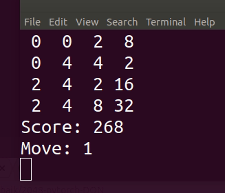
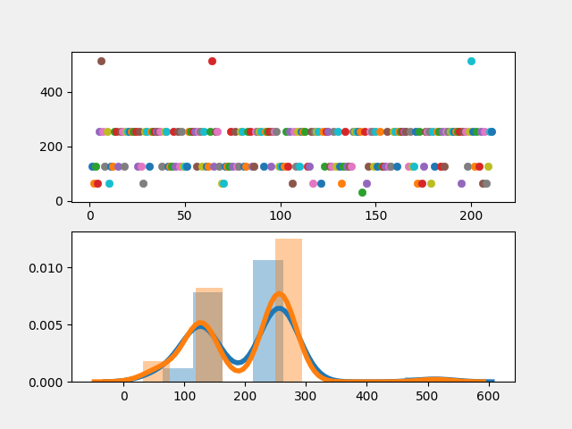
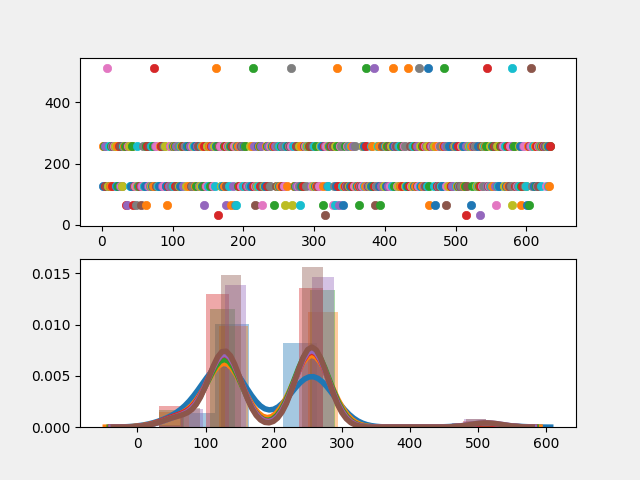

# 2048-PyTorch-DQN

Implementing [Deep Q-Network](https://deepmind.com/research/dqn/) with `PyTorch` to solve 2048. 
It supports [DQN](https://arxiv.org/abs/1312.5602), [Double DQN](https://arxiv.org/abs/1509.06461), and 
[Dueling DQN](https://arxiv.org/abs/1511.06581).

### Requirements
`NVIDIA GPU` and `CUDA`, of course...  and `PyTorch-0.4`, along with some others in `requirements.txt`

### 2048

[2048](https://github.com/gabrielecirulli/2048) is a popular game by Gabriele Cirulli, 
and I am using a version of [gym](https://github.com/mllobet/gym-2048).

### How to use this...
One could rely on pure `explorations`, but `optimal moves` in `2048` are
`probabilistically speaking` not observed often enough, if played randomly. Therefore, use generated data that teach the `Q network` for better moves. Those generated data come from
the discussion [here](https://stackoverflow.com/questions/22342854/what-is-the-optimal-algorithm-for-the-game-2048) and [here](https://github.com/nneonneo/2048-ai).

To generate data, run the following:

    $ python3 generate_replay_memory_cpp.py

To start the training, run the following:
    
    $ python3 train_dqn.py

### Results

#### Without training data:
After some training (of more than 6 hours with NVIDIA 1060), 
I did not see much performance gain relative to random moves.

The original model had a weakness. The original scoring system in the game 
makes the agent unable to learn the essence of an `optimal move`. With the
original scoring system of 2048, it did not (probabilistically speaking)
see the value in `corners`; this will only make sense to those who knows how to play 2048.
 
A solution to make the training go faster was to change the score system for the agent.
But such is not applicable to other games.
Another solution was to have a ridiculous amount of training hours... And hope `DQN` sees the
value in `corners`.

**tl; dr**

`exploration` does not work in this case.
My final solution was to use `generated data` which has examples of reasonable moves.

#### With training data:
`python` version of generating data by `breadth-first-search` is horribly slow... So, I took a
[C++ version](https://github.com/nneonneo/2048-ai) and modified some to suit my needs.

After one hour of training with generated data, it sees some value in `corners`.

After **one hour** training, the distribution of the largest tiles generated is like this:

After **two hours** of training:

